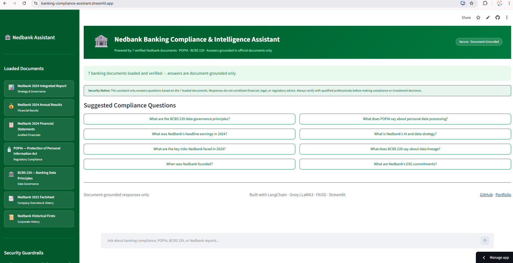
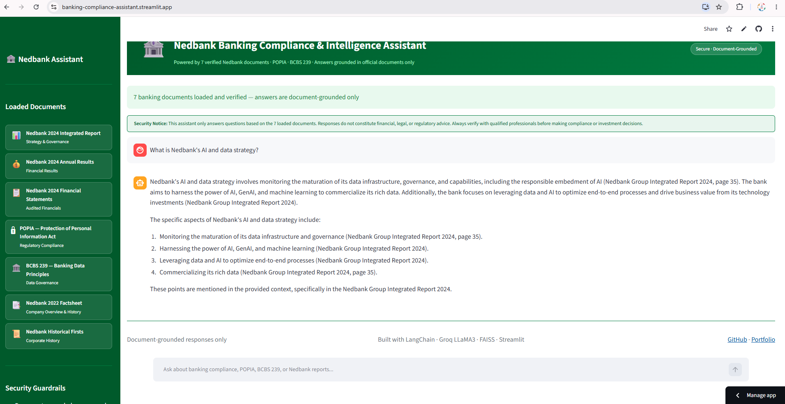
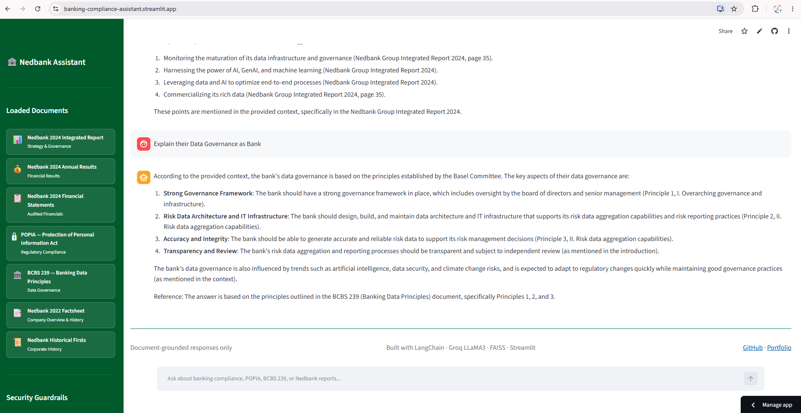

# 🏦 Banking Compliance & Intelligence Assistant

> An AI-powered Retrieval-Augmented Generation (RAG) application that reads verified banking documents and answers compliance, governance, and financial questions using document-grounded responses only.

**Built by [Thobani Antony Zondi](https://datascienceportfol.io/thobanizondi) · Portfolio Project · Not an official Nedbank product**

---

## Table of Contents

- [Overview](#overview)
- [Live Demo](#live-demo)
- [Features](#features)
- [Architecture](#architecture)
- [RAG Pipeline](#rag-pipeline)
- [Loaded Documents](#loaded-documents)
- [Security Guardrails](#security-guardrails)
- [Project Structure](#project-structure)
- [Getting Started](#getting-started)
- [Tech Stack](#tech-stack)
- [Screenshots](#screenshots)
- [Disclaimer](#disclaimer)
- [About](#about)

---

## Overview

The Banking Compliance & Intelligence Assistant is a production-style RAG application that ingests 7 publicly available banking and regulatory documents — including Nedbank's 2024 Annual Reports, POPIA, and BCBS 239 — and answers natural-language questions with answers sourced exclusively from those documents.

This project demonstrates end-to-end RAG pipeline delivery: document ingestion, chunking, local vector embeddings, FAISS similarity search, and LLM inference via Groq LLaMA 3.3 70B, served through a professional Streamlit chat interface styled with Nedbank's brand colours.

---

## Live Demo

🔗 **[Try the Live App →](https://banking-compliance-assistant.streamlit.app/)**

---

## Features

-  **Document-grounded answers only** — no hallucination, no external knowledge
-  **7 verified banking documents** loaded and searchable
-  **POPIA and BCBS 239 compliance** awareness built in
-  **Nedbank 2024 financial data** — headline earnings, risk, strategy
-  **Nedbank history** from 1831 to present
-  **Security guardrails** enforced at system prompt level
-  **Chat interface** with suggested compliance questions
-  **Nedbank-branded UI** using official green colour scheme
-  **Fast inference** via Groq LLaMA 3.3 70B
-  **Free to run** — no paid API required beyond Groq free tier

---

## Architecture

```
PDF Documents (7 files)
        ↓
PyPDF Text Extraction
        ↓
RecursiveCharacterTextSplitter (500 chars, 50 overlap)
        ↓
HuggingFace Embeddings (all-MiniLM-L6-v2) — runs locally
        ↓
FAISS Vector Store (similarity search, top-5 retrieval)
        ↓
User Question → Similarity Search → Relevant Chunks
        ↓
Groq LLaMA 3.3 70B + Security Guardrail System Prompt
        ↓
Document-grounded Answer → Streamlit Chat Interface
```

---

## RAG Pipeline

| Stage | Tool | Purpose |
|---|---|---|
| Document Loading | PyPDF | Extract text from all PDF files in documents/ folder |
| Text Splitting | LangChain RecursiveCharacterTextSplitter | Split into 500-char chunks with 50-char overlap |
| Embeddings | HuggingFace all-MiniLM-L6-v2 | Convert chunks to vectors locally — no API cost |
| Vector Store | FAISS | Index and search vectors by semantic similarity |
| Retrieval | FAISS similarity search | Return top-5 most relevant chunks per question |
| LLM Inference | Groq LLaMA 3.3 70B | Generate answers from retrieved context |
| UI | Streamlit | Professional chat interface with Nedbank branding |

---

## Loaded Documents

| Document | Type | Source |
|---|---|---|
| Nedbank 2024 Integrated Report | Strategy & Governance | Nedbank Group Investor Relations |
| Nedbank 2024 Annual Results Booklet | Financial Results | Nedbank Group Investor Relations |
| Nedbank 2024 Annual Financial Statements | Audited Financials | Nedbank Group Investor Relations |
| POPIA — Protection of Personal Information Act | Regulatory Compliance | Department of Justice South Africa |
| BCBS 239 — Principles for Effective Risk Data Aggregation | Data Governance | Bank for International Settlements |
| Nedbank 2022 Factsheet | Company Overview & History | Nedbank Group |
| Nedbank Historical Firsts | Corporate History | Nedbank Group |

All documents are publicly available. No confidential or proprietary data is used.

---

## Security Guardrails

The following guardrails are enforced at the system prompt level on every query:

-  **Document-grounded only** — answers must come from loaded documents, never external knowledge
-  **No hallucination policy** — if the answer is not in the documents, the assistant says so
-  **Source citation required** — every answer must cite the source document
-  **No financial advice** — the assistant declines investment or financial recommendations
-  **No legal opinions** — regulatory information is provided as-is, not as legal advice
-  **POPIA-aware** — PII and sensitive personal data questions are declined and redirected
-  **No speculation** — future performance, stock prices, and market predictions are refused
-  **Banking domain only** — off-topic questions are declined

---

## Project Structure

```
banking-compliance-rag-assistant/
├── documents/                    # PDF knowledge base (7 documents)
│   ├── 2024-integrated-report-nedbank.pdf
│   ├── 2024-annual-results-booklet-nedbank.pdf
│   ├── 2024-annual-financial-statements-nedbank-limited.pdf
│   ├── Popia-Act.pdf
│   ├── bcbs-239.pdf
│   ├── nedbank-factsheet.pdf
│   └── nedbank-firsts.pdf
├── retrieval_engine/             # RAG pipeline logic
│   ├── __init__.py
│   └── rag_engine.py             # Document loading, vector store, QA chain
├── dashboard/                    # Streamlit UI
│   ├── __init__.py
│   └── interface.py              # Nedbank-branded chat interface
├── screenshots/                  # App screenshots
├── .env                          # API keys (not committed)
├── .gitignore
├── requirements.txt
└── README.md
```

---

## Getting Started

### 1. Clone the repository

```bash
git clone https://github.com/thobanizondi/banking-compliance-rag-assistant.git
cd banking-compliance-rag-assistant
```

### 2. Create and activate virtual environment

```bash
python -m venv venv --without-pip
source venv/Scripts/activate       # Windows Git Bash
curl https://bootstrap.pypa.io/get-pip.py -o get-pip.py
python get-pip.py
```

### 3. Install dependencies

```bash
python -m pip install -r requirements.txt
```

### 4. Set up environment variables

Create a `.env` file in the root folder:

```
GROQ_API_KEY=your_groq_api_key_here
```

Get your free API key at: https://console.groq.com

### 5. Add banking documents

Place your PDF files in the `documents/` folder. The pipeline automatically detects and loads all PDFs in that folder.

### 6. Run the application

```bash
streamlit run dashboard/interface.py --server.fileWatcherType none
```

Open your browser at `http://localhost:8501`

---

## Tech Stack

| Technology | Version | Purpose |
|---|---|---|
| Python | 3.12 | Core language |
| LangChain | Latest | RAG orchestration framework |
| LangChain Community | Latest | FAISS vector store integration |
| LangChain Text Splitters | Latest | Document chunking |
| FAISS CPU | Latest | Vector similarity search |
| HuggingFace Sentence Transformers | Latest | Local embedding model |
| Groq | Latest | LLM inference (LLaMA 3.3 70B) |
| PyPDF | Latest | PDF text extraction |
| Streamlit | Latest | Web UI framework |
| Python Dotenv | Latest | Environment variable management |

---

## Screenshots

### Dashboard


### Suggested Questions


### Answer Example


---

## Disclaimer

**This is an independent portfolio project built by Thobani Antony Zondi.**

- This application is **not an official Nedbank product** and is not affiliated with, endorsed by, or connected to Nedbank Group Limited in any way.
- All documents used are **publicly available** via Nedbank Group Investor Relations and official regulatory bodies.
- Answers generated by this assistant **do not constitute financial, legal, or regulatory advice**.
- Always consult qualified professionals before making compliance, investment, or legal decisions.
- The Nedbank name and green colour scheme are used solely for educational and portfolio demonstration purposes.

---

## About

**Thobani Antony Zondi**
Data Engineer | SQL Database Developer
Johannesburg, South Africa

- 🌐 Portfolio: [datascienceportfol.io/thobanizondi](https://datascienceportfol.io/thobanizondi)
- 💼 GitHub: [github.com/thobanizondi](https://github.com/thobanizondi)
- 🔗 LinkedIn: [linkedin.com/in/thobani-zondi](https://linkedin.com/in/thobani-zondi)

---

## 📄 License

MIT License — free to use and adapt with attribution.